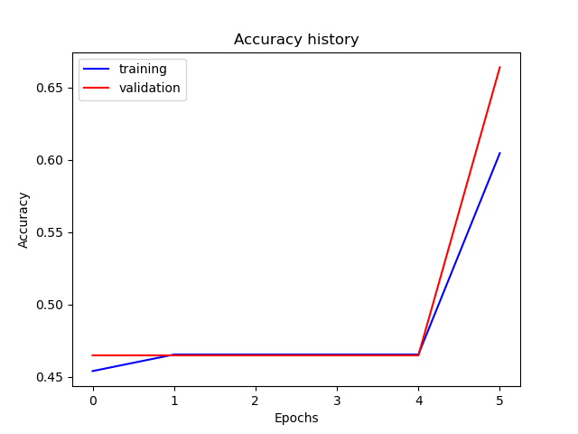
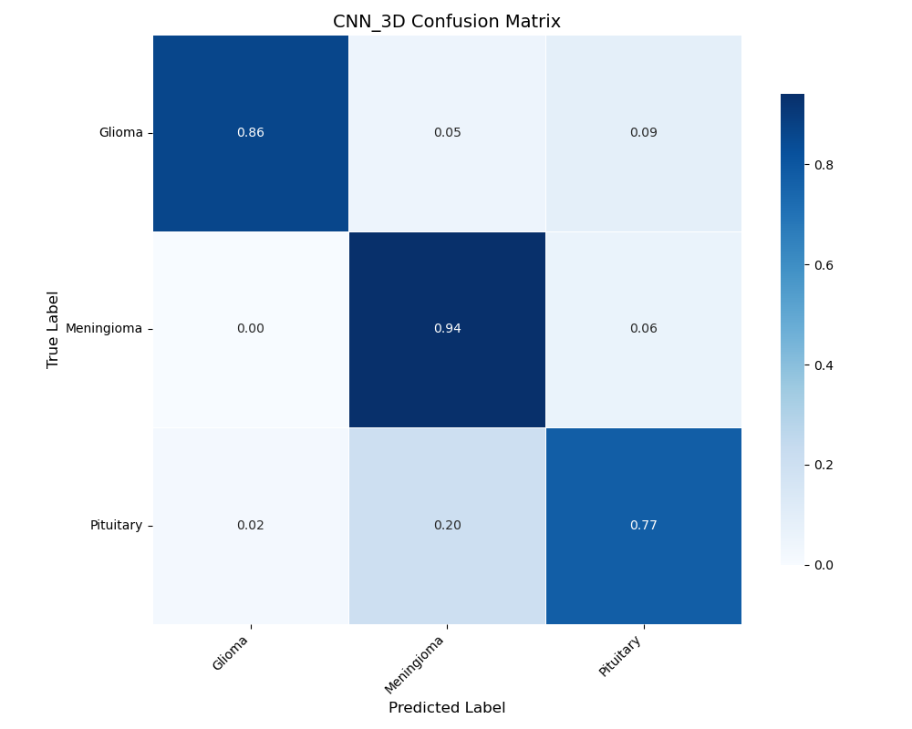

<div align="center">

# TumorTrace

### Comparing deep learning approaches to brain tumor classification from MRI scans

[](../environments/environment.yaml)
[](https://pytorch.org/)
[](#responsible-use)

**87.8% validation accuracy · 3 model families · 3 tumor classes · 1 reproducible workflow**

</div>

TumorTrace is an open research project that benchmarks three deep learning strategies for classifying **glioma**, **meningioma**, and **pituitary tumors** in brain MRI images. It brings a custom 3D CNN and two transfer-learning baselines into one PyTorch pipeline, making it easy to compare how each architecture learns, performs, and fails.

> TumorTrace is an educational research prototype—not a medical device or a substitute for clinical judgment.

## Why TumorTrace?

- **Compare architectures fairly.** Train and evaluate a custom 3D CNN, ResNet18, and Inception v3 through the same workflow.
- **Go beyond a single score.** Explore accuracy and loss curves, per-class precision and recall, macro F1 scores, confusion matrices, and misclassified examples.
- **Reproduce the experiment.** Download and prepare the public dataset, apply augmentations, train models, and generate evaluation artifacts from one notebook.
- **Start from working checkpoints.** Inspect the included trained weights or retrain each architecture with your own configuration.

## Results at a glance

Results below come from the recorded run in [`notebooks/main.ipynb`](../notebooks/main.ipynb) on a 613-image held-out split.

| Model | Approach | Trainable parameters | Validation accuracy | Macro F1 |
| --- | --- | ---: | ---: | ---: |
| **3D CNN** | Custom residual 3D convolutions | 2,758,115 | **87.8%** | **0.8644** |
| **Inception v3** | ImageNet transfer learning | 2,447,598 | 85.6% | 0.8257 |
| **ResNet18** | ImageNet transfer learning | 66,051 | 85.2% | 0.8291 |

The custom 3D CNN delivered the strongest overall result in this experiment, with the highest validation accuracy and macro F1 score. The transfer-learning models remained competitive while fine-tuning fewer parameters than a full network.

<table>
  <tr>
    <td align="center"><strong>3D CNN accuracy</strong></td>
    <td align="center"><strong>3D CNN confusion matrix</strong></td>
  </tr>
  <tr>
    <td></td>
    <td></td>
  </tr>
</table>

See every saved chart and error-analysis image in [`results/`](../results/).

## How it works

```text
Kaggle MRI dataset
        ↓
Download and preprocessing
        ↓
Train/test split and augmentation
        ↓
3D CNN · ResNet18 · Inception v3
        ↓
Accuracy · Macro F1 · Confusion matrices · Error analysis
```

The preprocessing pipeline converts the source data into a class-based directory structure, computes dataset normalization statistics, and supports grouping adjacent MRI slices for 3D inputs. The shared trainer then handles optimization, checkpointing, validation, and reporting for all three architectures.

## Quick start

### 1. Clone the project

```bash
git clone https://github.com/willakins/TumorTrace.git
cd TumorTrace
```

### 2. Create the environment

```bash
conda env create -f environments/environment.yaml
conda activate TumorTrace
```

### 3. Configure Kaggle access

Download a Kaggle API token and place `kaggle.json` in `~/.kaggle/`. On macOS or Linux, restrict the file permissions:

```bash
chmod 600 ~/.kaggle/kaggle.json
```

The notebook downloads the [Brain Tumor Classification MRI Images dataset](https://www.kaggle.com/datasets/jarvisgroot/brain-tumor-classification-mri-images) when the raw data directory is empty.

### 4. Run the experiment

Open [`notebooks/main.ipynb`](../notebooks/main.ipynb) in Jupyter and run the cells in order. The notebook prepares the dataset, trains all three models, prints classification reports, and regenerates the plots in `results/`.

Training automatically uses CUDA when a compatible GPU is available and falls back to CPU otherwise.

## Project structure

```text
TumorTrace/
├── data/           Dataset loading, preprocessing, and augmentation
├── docs/           Project reports and supporting documentation
├── environments/   Reproducible Conda environment
├── notebooks/      End-to-end model comparison experiment
├── results/        Accuracy, loss, confusion-matrix, and error plots
├── src/
│   ├── models/     3D CNN, ResNet18, Inception v3, and trained weights
│   ├── optimizer.py
│   └── runner.py   Shared training and validation loop
└── utils/          Dataset, metrics, plotting, and analysis helpers
```

## Explore the research

- [`Project_Final.pdf`](Project_Final.pdf) — complete methodology, experiments, and findings
- [`notebooks/main.ipynb`](../notebooks/main.ipynb) — executable model comparison and recorded outputs
- [`results/`](../results/) — learning curves, confusion matrices, and error analysis
- [`src/models/`](../src/models/) — architecture implementations and trained checkpoints

## Responsible use

Medical imaging models can be wrong, biased, or unreliable outside their training distribution. TumorTrace was built for education and experimentation using a public dataset. It has not been clinically validated, should not be used to diagnose patients, and must not replace review by qualified healthcare professionals.

If you extend this work, evaluate data provenance, patient privacy, subgroup performance, calibration, external validity, and failure modes before considering any real-world application.

## Team

- **Jimmy Vu** — Inception model and 3D CNN support
- **William Akins** — ResNet model, experiment notebook, training runner, and preprocessing
- **Chen Zhang** — 3D CNN and visualization utilities

Built for CS 4644: Deep Learning, Spring 2025.
